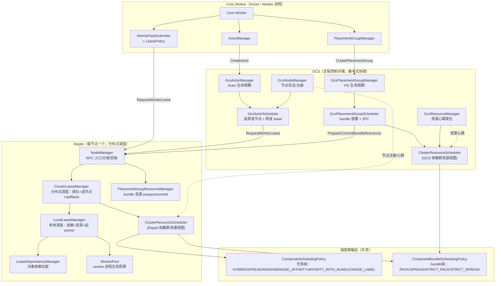
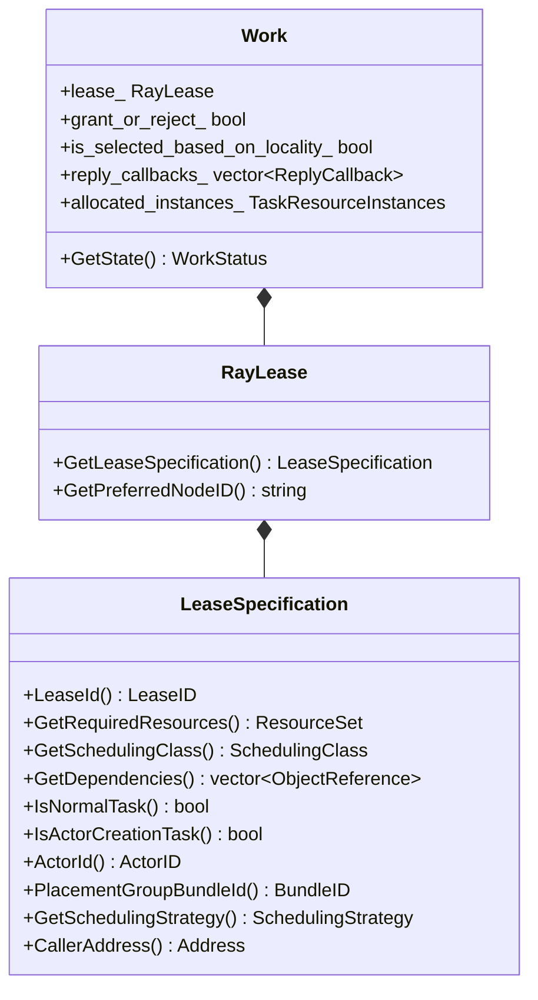
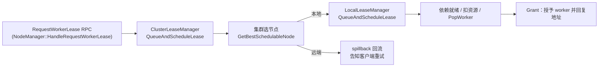
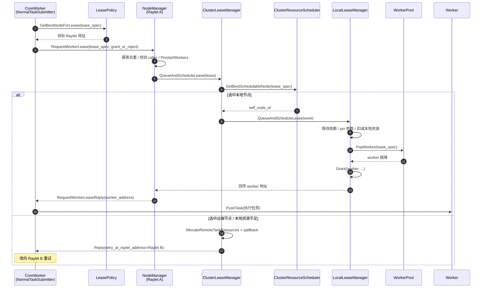
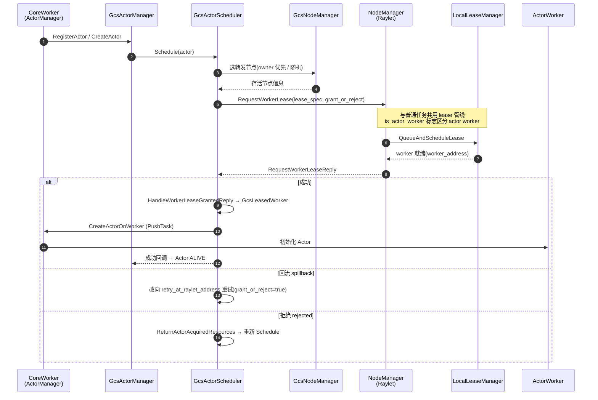
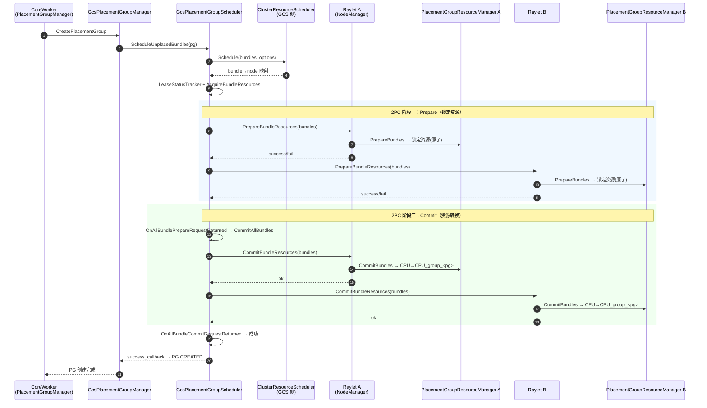
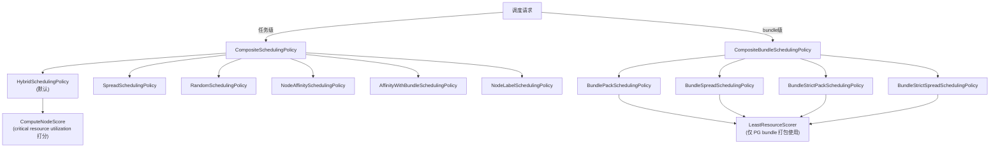
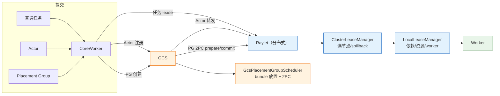

# Ray 调度逻辑梳理：Task / Actor / Placement Group

> 本文基于当前开源 Ray 代码库（`src/ray`）提炼，聚焦 Ray 三种核心调度场景——
> **普通任务（Normal Task）**、**Actor**、**Placement Group**——从**组件**的视角梳理调度代码流程，
> 并配合 Mermaid 图讲解。
>
> 文档中标注的 `文件:行号` 均对应仓库实际代码，可直接跳转查看。

---

## 目录

1. [总体架构：两种调度范式](#1-总体架构两种调度范式)
2. [核心组件总览](#2-核心组件总览)
3. [统一 Lease 抽象](#3-统一-lease-抽象)
4. [普通任务（Normal Task）调度流程](#4-普通任务normal-task调度流程)
5. [Actor 调度流程](#5-actor-调度流程)
6. [Placement Group 调度流程](#6-placement-group-调度流程)
7. [节点选择与调度策略](#7-节点选择与调度策略)
8. [三种场景对比](#8-三种场景对比)
9. [关键代码文件索引](#9-关键代码文件索引)

---

## 1. 总体架构：两种调度范式

Ray 的调度并非只有一个"中央调度器"，而是根据调度对象的不同，分为两种**协调范式**：

| 范式 | 调度对象 | 决策者 | 集群资源视图来源 |
|------|----------|--------|------------------|
| **分布式调度（Raylet 内）** | 普通任务、Actor（转发后） | 每个节点上的 Raylet（`ClusterLeaseManager` + `ClusterResourceScheduler`） | Raylet 通过资源心跳/同步维护的**本地集群视图** |
| **集中式调度（GCS 内）** | Placement Group（bundle 放置） | GCS 进程（`GcsPlacementGroupScheduler` + 自有 `ClusterResourceScheduler`） | GCS 通过 `GcsNodeManager`/`GcsResourceManager` 聚合的**权威集群视图** |

关键洞察：

- **普通任务**：由 CoreWorker 根据**本地性策略（lease policy）**先挑一个 Raylet，把任务包装成 **lease 请求**发过去；
  该 Raylet 用自己维护的集群资源视图选节点，选不中本地就 **spillback（回流）** 到其他节点。
  整体是"无中央协调"的分布式调度。
- **Actor**：注册到 GCS，由 `GcsActorScheduler` 选一个**转发节点**（owner 节点或随机），
  再把 Actor 创建任务作为 lease 请求转发给该 Raylet，**实际的资源调度仍然在 Raylet 内完成**。
  即 GCS 负责 Actor 生命周期管理 + 选转发节点，Raylet 负责落节点。
- **Placement Group**：完全由 **GCS 集中调度**，GCS 用自己的 `ClusterResourceScheduler` 做 bundle 放置决策，
  再通过 **两阶段提交（2PC）** 协议把 bundle 资源 Prepare/Commit 到各 Raylet。

无论哪种对象，落到 Raylet 之后都走**同一条统一的 Lease 调度管线**（见第 3 节）。

---

## 2. 核心组件总览

### 2.1 CoreWorker 侧（任务/请求发起方）

| 组件 | 文件 | 职责 |
|------|------|------|
| `NormalTaskSubmitter` | `src/ray/core_worker/task_submission/normal_task_submitter.cc` | 普通任务提交，把任务按 scheduling class 聚合，批量发起 lease 请求 |
| `LeasePolicyInterface` / `LocalityAwareLeasePolicy` / `LocalLeasePolicy` | `src/ray/core_worker/lease_policy.cc/.h` | 客户端本地性策略：为 lease 请求挑选目标 Raylet |
| `ActorCreator` | `src/ray/core_worker/actor_management/actor_creator.cc` | 封装 GCS ActorInfo RPC：`RegisterActor` / `CreateActor` / `ReportActorOutOfScope` |
| `ActorManager` | `src/ray/core_worker/actor_management/actor_manager.cc` | 本地 actor handle 表、引用计数、订阅 GCS 状态推送、驱动 Connect/Disconnect |
| `ActorTaskSubmitter` | `src/ray/core_worker/task_submission/actor_task_submitter.cc` | actor 创建任务/方法调用队列、依赖解析、out-of-scope 上报 |
| `CoreWorker::CreatePlacementGroup` | `src/ray/core_worker/core_worker.cc` | 构建 PG spec 并向 GCS 提交创建请求（经 `PlacementGroupInfoAccessor::SyncCreatePlacementGroup`） |

### 2.2 GCS 侧（集中式协调）

| 组件 | 文件 | 职责 |
|------|------|------|
| `GcsNodeManager` | `src/ray/gcs/gcs_node_manager.cc/.h` | 节点注册/注销/存活检测，供调度器选节点 |
| `GcsResourceManager` | `src/ray/gcs/gcs_resource_manager.cc/.h` | 聚合各 Raylet 上报的资源心跳，维护集群资源快照 |
| `GcsActorManager` | `src/ray/gcs/actor/gcs_actor_manager.cc/.h` | Actor 生命周期状态机（pending → alive → dead） |
| `GcsActorScheduler` | `src/ray/gcs/actor/gcs_actor_scheduler.cc/.h` | 选转发节点、发 lease、处理 lease 结果、创建 Actor |
| `GcsPlacementGroupManager` | `src/ray/gcs/gcs_placement_group_manager.cc/.h` | PG 生命周期状态机 |
| `GcsPlacementGroupScheduler` | `src/ray/gcs/gcs_placement_group_scheduler.cc/.h` | bundle 放置决策 + 2PC（prepare/commit） |

> GCS 内部也持有一个 `ClusterResourceScheduler` 实例（`gcs_server.cc:439 InitClusterResourceScheduler`），
> 主要用于 PG 的 bundle 放置，以及 `GcsResourceManager` 对外提供资源查询。

### 2.3 Raylet 侧（分布式调度）

| 组件 | 文件 | 职责 |
|------|------|------|
| `NodeManager` | `src/ray/raylet/node_manager.cc/.h` | Raylet 的 RPC 入口，转发 lease 请求、分发任务、回收 lease、处理 PG bundle 资源 |
| `ClusterLeaseManager` | `src/ray/raylet/scheduling/cluster_lease_manager.cc/.h` | **分布式调度器**：lease 排队、集群内选节点、spillback、infeasible 队列 |
| `LocalLeaseManager` | `src/ray/raylet/scheduling/local_lease_manager.cc/.h` | **本地调度器**：依赖解析、本地资源扣减、起 worker、把 lease 授予 worker |
| `ClusterResourceScheduler` | `src/ray/raylet/scheduling/cluster_resource_scheduler.cc/.h` | 集群资源视图：`LocalResourceManager`（本机）+ `ClusterResourceManager`（集群）+ 调度策略 |
| `LeaseDependencyManager` | `src/ray/raylet/lease_dependency_manager.cc/.h` | 把 lease 的对象依赖拉到本地 |
| `WorkerPool` | `src/ray/raylet/worker_pool.cc/.h` | worker 进程的创建/复用/回收 |
| `PlacementGroupResourceManager` | `src/ray/raylet/placement_group_resource_manager.cc/.h` | bundle 资源 prepare/commit/return（2PC 的 Raylet 端） |

### 2.4 调度策略层（被 `ClusterResourceScheduler` 调用）

| 组件 | 文件 | 职责 |
|------|------|------|
| `CompositeSchedulingPolicy` | `policy/composite_scheduling_policy.h` | 按 `SchedulingType` 路由到任务级策略 |
| `CompositeBundleSchedulingPolicy` | `policy/composite_scheduling_policy.h` | 按 `SchedulingType` 路由到 bundle 级策略 |
| `HybridSchedulingPolicy` | `policy/hybrid_scheduling_policy.h` | 混合策略：打分 + top-k 随机 |
| `SpreadSchedulingPolicy` / `RandomSchedulingPolicy` | `policy/…` | 分散/随机 |
| `NodeAffinitySchedulingPolicy` | `policy/node_affinity_scheduling_policy.h` | 指定节点亲和 |
| `AffinityWithBundleSchedulingPolicy` | `policy/affinity_with_bundle_scheduling_policy.h` | 任务绑定到 PG bundle 所在节点 |
| `NodeLabelSchedulingPolicy` | `policy/node_label_scheduling_policy.h` | 按节点标签（label selector）调度 |
| `Bundle*SchedulingPolicy` | `policy/bundle_scheduling_policy.h` | PACK/SPREAD/STRICT_PACK/STRICT_SPREAD |
| `LeastResourceScorer` | `policy/scorer.h` | 节点打分（least resource） |

---

## 3. 统一 Lease 抽象

这是理解当前 Ray 调度的关键。历史版本中 task / actor 走不同入口（`ClusterTaskManager` / `LocalTaskManager`），
当前代码已统一抽象为 **Lease（租约）**：

- **`LeaseSpecification`**（`src/ray/common/lease/lease_spec.h`）：从 `TaskSpec` 提炼出的、Raylet 调度所需的**不可变子集**
  （资源需求、依赖、scheduling class、bundle id、actor id 等）。
- **`RayLease`**（`src/ray/common/lease/lease.h`）：一次可调度工作的统一载体，普通任务、Actor 创建任务都变成 lease。
- **`Work`**（`src/ray/raylet/scheduling/internal.h`）：lease 在调度管线中流动时的"工作项"包装，
  附带状态（`WAITING` / `WAITING_FOR_WORKER` / `CANCELLED`）、回复回调、分配的资源实例。
- **`SchedulingClass`**：相同资源形状 + 函数描述的聚合键，用于**按类排队**（避免逐任务排队，提升效率）。

**统一后的管线**（任务与 Actor 创建任务共用）：

---

## 4. 普通任务（Normal Task）调度流程

### 4.1 调用链（每步均标注文件:行号）

1. **客户端提交并选 Raylet**
   `NormalTaskSubmitter` 按 scheduling class 聚合任务；决定需要新 lease 时，调用
   `LeasePolicyInterface::GetBestNodeForLease`（`normal_task_submitter.cc:318`）选目标 Raylet，
   然后发 `RequestWorkerLease`（`normal_task_submitter.cc:328`）。
   - `LocalityAwareLeasePolicy`（默认）：基于对象依赖的本地性选节点——统计每个依赖对象在各节点的本地字节数，取最大者（`lease_policy.cc:24-88`）；
   - `LocalLeasePolicy`：直接选本地 Raylet（`lease_policy.cc:90`）。
   - 两种策略均**不经 GCS 选节点**，GCS 仅用于把 NodeID 翻译成 RPC 地址。

2. **Raylet 入口**
   `NodeManager::HandleRequestWorkerLease`（`node_manager.cc:1781`）：幂等去重（已 lease 过的直接回地址）、
   校验 caller 存活、`PrestartWorkers` 预热，然后调用 `ClusterLeaseManager::QueueAndScheduleLease`（`node_manager.cc:1857`）。

3. **分布式调度：排队 + 选节点**
   `ClusterLeaseManager::QueueAndScheduleLease`（`cluster_lease_manager.cc:47`）按 `SchedulingClass` 入队；
   `ScheduleAndGrantLeases`（`cluster_lease_manager.cc:196`）遍历队列，调用
   `ClusterResourceScheduler::GetBestSchedulableNode`（`cluster_lease_manager.cc:214`）选节点；
   `ScheduleOnNode`（`cluster_lease_manager.cc:422`）：
   - 选中本地 → 交给 `LocalLeaseManager::QueueAndScheduleLease`；
   - 选中远端 → **spillback**：`AllocateRemoteTaskResources` 预留资源 + 回复 `retry_at_raylet_address`（`cluster_lease_manager.cc:437-460`），客户端改向目标 Raylet 重试。

4. **本地调度：依赖 + 资源 + 起 worker**
   `LocalLeaseManager::QueueAndScheduleLease`（`local_lease_manager.cc:79`）→ `WaitForLeaseArgsRequests` 登记依赖；
   `GrantScheduledLeasesToWorkers`（`local_lease_manager.cc:136`）核心逻辑：
   - `PinLeaseArgsIfMemoryAvailable`（`local_lease_manager.cc:316`）pin 参数；
   - `AllocateLocalTaskResources`（`local_lease_manager.cc:358`）扣减本地资源；
   - `WorkerPool::PopWorker`（`local_lease_manager.cc:389`）获取/启动 worker；
   - 成功后 `Grant`（`local_lease_manager.cc:971`）把 lease 授予 worker 并回传 worker 地址。

5. **执行与回收**
   worker 执行任务；任务结束后客户端发 `ReturnWorkerLease`，
   `NodeManager::HandleReturnWorkerLease`（`node_manager.cc:2080`）→
   `LocalLeaseManager::ReleaseWorkerResources`（`node_manager.cc:2110`）释放资源、回收 worker。

### 4.2 时序图

### 4.3 关键点

- **head-of-line 避免**：`ClusterLeaseManager` / `LocalLeaseManager` 的调度循环**遍历整个队列**而非只看队首，
  避免某个无法调度的 lease 阻塞同 shape 的其他 lease。
- **infeasible 队列**：集群内任何节点都装不下时进入 `infeasible_leases_`，
  并通过 `announce_infeasible_lease` 上报 GCS（触发 autoscaler 扩容）；`TryScheduleInfeasibleLease`（`cluster_lease_manager.cc:298`）在新节点加入后重试。
- **spillback 双阶段**：先在选中的远端节点"预留资源"再回 `retry_at_raylet_address`，客户端重试时带 `grant_or_reject=true`，
  目标 Raylet 若本地资源已不足则直接 **reject**，回到 owner 节点重新调度。
- **公平调度 / class cap**：`LocalLeaseManager` 在 CPU 超载时按 scheduling class 做公平 share（`local_lease_manager.cc:191-261`），
  并对单类 worker 进程数做指数退避限流（`local_lease_manager.cc:281-313`）。

---

## 5. Actor 调度流程

### 5.1 调用链（每步均标注文件:行号）

1. **注册 + 创建请求（CoreWorker 侧，入口已拆分）**
   `CoreWorker::CreateActor`（`core_worker.cc:2032`）构建 actor 创建任务 spec →
   `ActorCreator::RegisterActor / AsyncRegisterActor`（`actor_creator.cc:24/35`）向 GCS 注册（具名 actor 同步注册）；
   依赖解析完成后 `ActorTaskSubmitter::SubmitActorCreationTask`（`actor_task_submitter.cc:93`）→
   `ActorCreator::AsyncCreateActor`（`actor_creator.cc:79`）把 spec 发给 GCS。

2. **GCS 注册 + 状态机推进**
   `GcsActorManager::HandleRegisterActor` → `RegisterActor`（`gcs_actor_manager.cc:308/664`）写入 ActorTable（初态 `DEPENDENCIES_UNREADY`）；
   `HandleCreateActor` → `CreateActor`（`gcs_actor_manager.cc:426/798`）置 `PENDING_CREATION` 后调
   `gcs_actor_scheduler_->Schedule(actor)`（`gcs_actor_manager.cc:874`）。
   > 状态机：`DEPENDENCIES_UNREADY → PENDING_CREATION → ALIVE → RESTARTING → DEAD`。

3. **GCS 选转发节点 + 发 lease**
   `GcsActorScheduler::Schedule`（`gcs_actor_scheduler.cc:49`）：
   - `SelectForwardingNode`（`gcs_actor_scheduler.cc:83`）：有资源需求的优先选 owner 所在节点，否则随机选存活节点；
   - `LeaseWorkerFromNode`（`gcs_actor_scheduler.cc:234`）向该 Raylet 发 `RequestWorkerLease`（`gcs_actor_scheduler.cc:263`）。

4. **Raylet 复用统一 lease 管线**
   该请求落到 `NodeManager::HandleRequestWorkerLease`，`IsActorCreationTask() == true`，
   走与普通任务相同的 `ClusterLeaseManager` → `LocalLeaseManager` → `WorkerPool` 流程。
   区别在于：`WorkerPool::PopWorker` 以 `is_actor_worker = lease_spec.IsActorCreationTask()` 构造请求（`worker_pool.cc:1399`），
   一个 Actor 独占一个 worker，占用 `LifetimeAllocatedInstances`（终身资源）；
   授予时 `Worker::GrantLease`（`worker.h:135`）记录 `is_actor_worker` 与 `SetBundleId`（PG 绑定）；
   lease 归还时 `NodeManager::CleanupLease` 调 `ConvertWorkerToActor` → `AssignActorId`（`node_manager.cc:2391`）把 worker 转成 actor worker。

5. **lease 结果处理**
   `HandleWorkerLeaseReply`（`gcs_actor_scheduler.cc:519`）：
   - 成功 → `HandleWorkerLeaseGrantedReply`（`gcs_actor_scheduler.cc:296`）构造 `GcsLeasedWorker`；
   - 回流（`retry_at_raylet_address`）→ 改向 spillback 节点，`grant_or_reject=true`（`gcs_actor_scheduler.cc:318-319`）；
   - 拒绝 → `HandleWorkerLeaseRejectedReply`（`gcs_actor_scheduler.cc:601`）归还资源并重新调度。

6. **在 worker 上创建 Actor**
   `CreateActorOnWorker`（`gcs_actor_scheduler.cc:382`）向 CoreWorker 发创建 Actor 的 PushTask，
   CoreWorker 执行 `__init__` 后回调 `ActorCreationTaskDone`；GCS 的 `OnActorCreationSuccess`（`gcs_actor_manager.cc:1622`）把 Actor 状态置为 `ALIVE`。

7. **失败/恢复/清理**
   - 调度失败 → `OnActorSchedulingFailed`（`gcs_actor_manager.cc:1575`）进 pending 队列，新节点加入触发重调度；
   - `RestartActor`（`gcs_actor_manager.cc:1445`）处理 max_restarts 重启语义；
   - `CancelOnNode` / `CancelOnLeasing` / `CancelOnWorker`（`gcs_actor_scheduler.cc:126/154/181`）处理节点/lease/worker 失效；
   - `Reschedule`（`gcs_actor_scheduler.cc:101`）处理 GCS 重启后的恢复；`ReleaseUnusedActorWorkers`（`gcs_actor_scheduler.cc:200`）清理泄漏 worker。

### 5.2 时序图

### 5.3 关键点

- **GCS 是 Actor 生命周期权威**，但**资源落点由 Raylet 决定**：GCS 只选"转发节点"，
  真正的资源调度、spillback 都在 Raylet 完成（与普通任务一致）。
- **Actor 与普通任务的本质区别**：Actor 创建任务走 `IsActorCreationTask() == true` 分支，
  占用的是 `worker->GetLifetimeAllocatedInstances()`（终身占用，见 `local_lease_manager.cc:979-981`），
  而普通任务占用的是临时 `GetAllocatedInstances()`。
- **Actor 与 PG 的绑定**：若 Actor 指定了 PlacementGroupSchedulingStrategy，
  其 lease spec 携带 `PlacementGroupBundleId()`，Raylet 侧用 `AffinityWithBundleSchedulingPolicy` 把 Actor 调度到对应 bundle 所在节点。

---

## 6. Placement Group 调度流程

Placement Group 是三种场景中唯一**完全由 GCS 集中调度**的对象，其核心是**两阶段提交（2PC）**协议，
保证跨节点的 bundle 资源预留是原子且一致的。

### 6.1 调用链（每步均标注文件:行号）

1. **提交创建请求**
   `CoreWorker::CreatePlacementGroup`（`core_worker.cc:2239`）构建 PG spec →
   `PlacementGroupInfoAccessor::SyncCreatePlacementGroup`（`accessor.cc:718`）发 GCS RPC →
   `GcsPlacementGroupManager::HandleCreatePlacementGroup` → `RegisterPlacementGroup`（`gcs_placement_group_manager.cc:353/107`，初态 `PENDING`）。
   状态机：`PENDING → PREPARED → CREATED → REMOVED`（部分失败进入 `RESCHEDULING`）。

2. **GCS 集中放置决策**
   `GcsPlacementGroupScheduler::ScheduleUnplacedBundles`（`gcs_placement_group_scheduler.cc:41`）：
   - 收集所有未放置 bundle 的资源需求；
   - `CreateSchedulingOptions`（`gcs_placement_group_scheduler.cc:472`）根据 `PlacementStrategy`（PACK/SPREAD/STRICT_PACK/STRICT_SPREAD）生成调度选项；
   - 调用 **GCS 侧** `ClusterResourceScheduler::Schedule`（`gcs_placement_group_scheduler.cc:75`）得到 bundle → 节点映射；
   - 构造 `LeaseStatusTracker`（`gcs_placement_group_scheduler.cc:107-111`）跟踪 2PC 状态；
   - `AcquireBundleResources`（`gcs_placement_group_scheduler.cc:115`）先在 GCS 资源视图预留。

3. **2PC 阶段一：Prepare（资源锁定）**
   按节点分组，`PrepareResources`（`gcs_placement_group_scheduler.cc:178`）→
   Raylet `HandlePrepareBundleResources`（`node_manager.cc:1896`）→
   `PlacementGroupResourceManager::PrepareBundles`（`node_manager.cc:1908`）在本地**锁定**资源（原子性：一个 bundle 失败则全失败）。

4. **2PC 阶段二：Commit（资源转换）**
   所有 Prepare 成功返回后，`OnAllBundlePrepareRequestReturned`（`gcs_placement_group_scheduler.cc:366`）→
   `CommitAllBundles`（`gcs_placement_group_scheduler.cc:298`）→ `CommitResources`（`gcs_placement_group_scheduler.cc:209`）→
   Raylet `HandleCommitBundleResources`（`node_manager.cc:1913`）→
   `PlacementGroupResourceManager::CommitBundles`（`node_manager.cc:1924`），
   把普通资源转换为 PG 专用资源（如 `CPU → CPU_group_<pg_id>`），并触发 `ScheduleAndGrantLeases` 调度等待该 PG 的 lease。

5. **完成**
   `OnAllBundleCommitRequestReturned`（`gcs_placement_group_scheduler.cc:413`）→ 成功回调 → PG 状态置 CREATED。

6. **取消/回滚**
   `CancelResourceReserve`（`gcs_placement_group_scheduler.cc:235`）→ Raylet `HandleCancelResourceReserve`（`node_manager.cc:1930`）
   归还资源并取消关联 lease；失败带重试（`gcs_placement_group_scheduler.cc:272-278`）。

### 6.2 时序图（2PC 协议）

### 6.3 三种放置策略（bundle 放置算法）

| 策略 | 对应 policy 类 | 语义 |
|------|----------------|------|
| `PACK` | `BundlePackSchedulingPolicy` | 尽量把 bundle 挤到**少数节点**（软约束） |
| `SPREAD` | `BundleSpreadSchedulingPolicy` | 尽量把 bundle **分散**到不同节点（软约束） |
| `STRICT_PACK` | `BundleStrictPackSchedulingPolicy` | **必须**放在**同一个节点**（硬约束），可选 `soft_target_node_id` |
| `STRICT_SPREAD` | `BundleStrictSpreadSchedulingPolicy` | **必须**分散到**不同节点**（硬约束） |

这些策略实现于 `src/ray/raylet/scheduling/policy/bundle_scheduling_policy.h`，
由 `CompositeBundleSchedulingPolicy` 按 `SchedulingType` 路由，并使用 `LeastResourceScorer` 对节点打分。

### 6.4 关键点

- **GCS 侧与 Raylet 侧各有一份 `ClusterResourceScheduler`**：GCS 侧负责 PG 的 bundle 放置决策，
  Raylet 侧负责普通任务/Actor 的节点选择；两者都通过资源心跳同步，但可能短暂不一致（因此有 spillback/reject 机制兜底）。
- **`LeaseStatusTracker`**（`gcs_placement_group_scheduler.h:126`）是 2PC 的状态机，跟踪 `PREPARING → COMMITTING → CANCELLED`，
  以及每个 bundle 的 prepare/commit 是否返回。
- **任务与 bundle 的亲和绑定（资源改写机制）**：任务/Actor 通过 `PlacementGroupSchedulingStrategy` 指定 bundle 时，
  CoreWorker 用 `AddPlacementGroupConstraint`（`bundle_spec.cc:158`）把普通资源改写成 PG 专用资源
  `CPU_group_<pg_id>`（wildcard）与 `CPU_group_<index>_<pg_id>`（indexed），并额外加 `bundle_group_<pg_id>`（0.001）保证零资源任务也能绑定；
  这些 PG 资源只在 bundle 所在节点上存在（由 `CommitBundle` 挂载），因此 Raylet 常规路径下 hybrid/spread 策略**自然只会选中该节点**；
  GCS fallback 路径则显式走 `AffinityWithBundleSchedulingPolicy`（`affinity_with_bundle_scheduling_policy.cc:44`）从 `BundleLocationIndex` 查 bundle 所在节点。

---

## 7. 节点选择与调度策略

### 7.1 策略路由

`ClusterResourceScheduler` 内部持有一个 `scheduling_policy_`（任务级）和一个 `bundle_scheduling_policy_`（bundle 级），
统一暴露 `Schedule()` / `GetBestSchedulableNode()` 接口（`cluster_resource_scheduler.h:82/101`）。

`SchedulingType` 枚举（`policy/scheduling_options.h:30`）定义了全部策略类型：
`HYBRID / SPREAD / RANDOM / NODE_AFFINITY / BUNDLE_PACK / BUNDLE_SPREAD / BUNDLE_STRICT_PACK / BUNDLE_STRICT_SPREAD / AFFINITY_WITH_BUNDLE / NODE_LABEL`。

### 7.2 Hybrid 策略（默认任务策略）

`HybridSchedulingPolicy::Schedule`（`policy/hybrid_scheduling_policy.cc:183`）的核心思想（见 `hybrid_scheduling_policy.h:29-48` 注释）：

1. **过滤不可行节点**（资源不满足 / 节点不可用 / GPU filter）；
2. **打分**：`ComputeNodeScore` 依据 **critical resource utilization（关键资源利用率）**打分，低于 `spread_threshold` 截断为 0；
3. **top-k 随机**：在得分最低（最优）的 k 个节点中随机选一个，兼顾负载均衡；
4. **优先节点**：若指定了 preferred node 且其得分最低（最优），则直接选中；
5. **本地优先捷径**：`ClusterResourceScheduler::GetBestSchedulableNode`（`cluster_resource_scheduler.cc:320-327`）
   在 preferred 节点是本地且可用时，跳过完整 hybrid 打分直接返回本地。

> ⚠️ 易混点：`LeastResourceScorer`（`policy/scorer.h`）**不参与普通任务打分**，
> 它只在 `BundleSchedulingPolicy`（PG bundle 打包）里使用（`bundle_scheduling_policy.cc`）。
> 普通任务的打分逻辑是 hybrid policy 自己实现的 `ComputeNodeScore`（critical resource utilization）。

### 7.3 资源视图

`ClusterResourceScheduler` 由两部分组成（`cluster_resource_scheduler.h:216-227`）：

- `LocalResourceManager`：本节点资源（总量/可用/实例级分配，支持 CPU 实例、GPU、自定义资源）；
- `ClusterResourceManager`：全集群资源视图（`GetResourceView()` 暴露给策略层）；
- 两者之间通过资源心跳（`syncer::ResourceViewSyncMessage`，见 `cluster_lease_manager.cc:351`）与 GCS 同步。

---

## 8. 三种场景对比

| 维度 | 普通任务（Normal Task） | Actor | Placement Group |
|------|------------------------|-------|-----------------|
| **协调范式** | 分布式（Raylet） | 集中注册 + Raylet 调度 | 集中式（GCS） |
| **决策入口** | CoreWorker `NormalTaskSubmitter` + LeasePolicy | GCS `GcsActorScheduler::Schedule` | GCS `GcsPlacementGroupScheduler::ScheduleUnplacedBundles` |
| **资源视图** | Raylet 侧 `ClusterResourceScheduler` | Raylet 侧 `ClusterResourceScheduler`（经转发节点） | GCS 侧 `ClusterResourceScheduler` |
| **统一抽象** | Lease（`IsNormalTask()`） | Lease（`IsActorCreationTask()`） | Bundle（不走 lease 管线，走 2PC） |
| **worker 类型** | 普通 worker（可复用） | `is_actor_worker` 标志的 actor worker（独占、终身占用资源） | 无 worker，仅预留资源 |
| **资源占用** | 临时（任务结束归还） | 终身（Actor 销毁归还） | 预留（PG 销毁归还） |
| **跨节点一致性** | spillback + grant_or_reject | spillback + rejected 重调度 | **2PC prepare/commit 原子协议** |
| **失败/恢复** | infeasible 队列 + autoscaler | `CancelOnNode/Worker` + `Reschedule` | `CancelResourceReserve` + `LeaseStatusTracker` |
| **与 PG 关系** | 可指定 bundle，走 AffinityWithBundle | 可指定 bundle，走 AffinityWithBundle | 本身即资源容器 |

---

## 9. 关键代码文件索引

### 统一抽象
- `src/ray/common/lease/lease.h` — `RayLease`
- `src/ray/common/lease/lease_spec.h/.cc` — `LeaseSpecification`（从 TaskSpec 提炼调度子集）
- `src/ray/raylet/scheduling/internal.h` — `Work` / `WorkStatus` / `ReplyCallback`

### Raylet 调度管线
- `src/ray/raylet/node_manager.cc/.h` — `HandleRequestWorkerLease`(1781)、`HandleReturnWorkerLease`(2080)、`HandlePrepare/CommitBundleResources`(1896/1913)、`HandleCancelResourceReserve`(1930)
- `src/ray/raylet/scheduling/cluster_lease_manager.cc/.h` — 分布式调度：`QueueAndScheduleLease`(47)、`ScheduleAndGrantLeases`(196)、`ScheduleOnNode`(422)
- `src/ray/raylet/scheduling/local_lease_manager.cc/.h` — 本地调度：`GrantScheduledLeasesToWorkers`(136)、`PoppedWorkerHandler`(545)、`Grant`(971)
- `src/ray/raylet/scheduling/cluster_resource_scheduler.cc/.h` — 集群资源视图 + `GetBestSchedulableNode`
- `src/ray/raylet/worker_pool.cc/.h` — worker 进程生命周期
- `src/ray/raylet/lease_dependency_manager.cc/.h` — 对象依赖拉取
- `src/ray/raylet/placement_group_resource_manager.cc/.h` — bundle 资源 prepare/commit/return

### 调度策略
- `src/ray/raylet/scheduling/policy/composite_scheduling_policy.h` — 任务级/bundle级策略路由
- `src/ray/raylet/scheduling/policy/hybrid_scheduling_policy.h/.cc` — 默认混合策略
- `src/ray/raylet/scheduling/policy/bundle_scheduling_policy.h/.cc` — PG 放置策略
- `src/ray/raylet/scheduling/policy/affinity_with_bundle_scheduling_policy.h` — 任务↔bundle 亲和
- `src/ray/raylet/scheduling/policy/scorer.h/.cc` — `LeastResourceScorer`
- `src/ray/raylet/scheduling/policy/scheduling_options.h` — `SchedulingType` 与 `SchedulingOptions`

### CoreWorker 侧
- `src/ray/core_worker/task_submission/normal_task_submitter.cc` — 普通任务提交 + `RequestWorkerLease`(328)
- `src/ray/core_worker/lease_policy.cc/.h` — 客户端本地性策略
- `src/ray/core_worker/actor_management/actor_creator.cc` — GCS ActorInfo RPC 封装（RegisterActor/CreateActor）
- `src/ray/core_worker/actor_management/actor_manager.cc` — 本地 actor handle 表、状态订阅
- `src/ray/core_worker/task_submission/actor_task_submitter.cc` — actor 创建任务提交
- `src/ray/core_worker/core_worker.cc` — `CreateActor`(2032)、`CreatePlacementGroup`(2239)、`HandlePushTask`(3272)
- `src/ray/gcs_rpc_client/accessor.cc` — `SyncCreatePlacementGroup`(718) 等 GCS 客户端访问器

### GCS 侧
- `src/ray/gcs/gcs_server.cc` — `InitClusterResourceScheduler`(439)、`InitGcsNodeManager`(349)、组装各调度器
- `src/ray/gcs/gcs_node_manager.cc/.h` — 节点存活管理
- `src/ray/gcs/gcs_resource_manager.cc/.h` — 资源心跳聚合
- `src/ray/gcs/actor/gcs_actor_manager.cc/.h` — Actor 生命周期
- `src/ray/gcs/actor/gcs_actor_scheduler.cc/.h` — `Schedule`(49)、`LeaseWorkerFromNode`(234)、`HandleWorkerLeaseReply`(519)、`CreateActorOnWorker`(382)
- `src/ray/gcs/gcs_placement_group_manager.cc/.h` — PG 生命周期
- `src/ray/gcs/gcs_placement_group_scheduler.cc/.h` — `ScheduleUnplacedBundles`(41)、`PrepareResources`(178)、`CommitResources`(209)、`LeaseStatusTracker`

---

## 附：一张图总结

---

*本文基于仓库当前代码（commit 附近版本）梳理，若后续代码演进导致行号偏移，请以文件名 + 函数名定位。*
